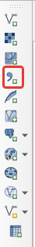
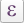
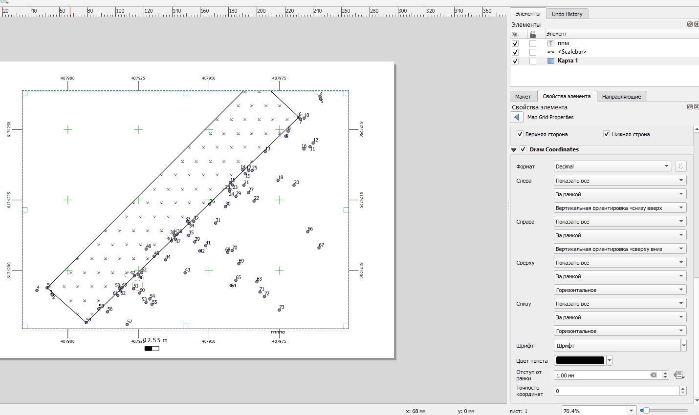

# Создание топографического плана {#map-topo}

## Чтение CSV-таблиц {#map-topo-csv-table-reading}
[В начало справки ⇡](#map-topo)

QGIS может читать данные в разном формате: векторном, растровом, табличном и других.

1. Подготовьте таблицу формата CSV, где будут содержаться данные по каждому пикету тахеометрии.

2. Все инструменты для чтения различных форматов данных стандартно расположены на панели слева. Для чтения CSV-таблицы используйте иконку в виде запятой.

> Примечание: Если у вас такой панели не оказалось, это значит, что она отключена. Для включения панели щелкните правой кнопкой мыши по пустому месту на панели и найдите **панель работы со слоями**.

4. В открывшемся окне **Менеджер источников данных | Delimited Text** укажите путь к CSV-файлу. В разделе Формат файла выберите или пропишите разделитель колонок в файле. Если разделитель указан верно, внизу в окошке предпросмотра (Примеры данных) вы увидите данные ячеек, разнесенные по соответствующим колонкам. При необходимости, если в текстовых полях вы видите непонятные символы, поменяйте кодировку (обычно это либо UTF-8, либо windows-1251). 

5. В разделе **Geometry Definition** мы указываем поле с геометрией объекта. Если файл CSV содержит координаты X и Y точек, то необходимо выбрать их соответствующее название из выпадающего списка напротив **X field** и **Y field**. Обращаем ваше внимание на то, что в QGIS, как и во всех ГИС-пакетах, реализована правая декартова система координат, то есть x (easting) – направлен на восток, y (northing) направлен на север. Ваши исходные данные могут быть с по-иному заданными осями.

6. В окошке Система координат геометрии необходимо указать правильную систему координат, в которую изначально подразумеваются ваши исходные данные. Если неправильно задать систему координат, объекты окажутся не в том месте, где хотелось бы их видеть.
После того, как были заданы все необходимые параметры, должна активироваться кнопка Добавить внизу окна. Если она не активирована, вероятно, есть ошибка при чтении данных, например, в исходной таблице неправильно указан десятичный разделитель (точка или запятая в зависимости от настроек операционной системы).

7. В окне карты должны появиться точечные объекты. Для удобства работы с сними можно добавить подписи этих точек. Для этого нужно зайти в свойства слоя (дважды щёлкнуть по слою), найти пункт **Подписи** и выбрать **Single labels**. В окне **Value** выбирается имя поля атрибутивной таблицы, по которому мы хотим получить подписи. Если вы хотите сделать сложную подпись на основе нескольких строк, нажмите на кнопку , откроется конструктор выражений. В среднем окне можно найти пункт Поля и значения. Двойной щелчок по имени поля добавляет его в выражение. Соединение значений полей осуществляется посредством конкатенации строк. Для этого используется символ . Например, если мы хотим вывести подпись по коду точки и по ее описанию, это может выглядеть так:
_“Code” || “ ” “Description”_

**Сохраните проект.**

## Создание базы данных для топографического плана {#map-topo-database}
[В начало справки ⇡](#map-topo)

QGIS поддерживает различные форматы пространственных данных. Среди них наиболее удобным для хранения и работы считается формат **Geopackage**. По сути это формат базы пространственных данных, внутри которой мы можем складывать различные классы объектов. Для создания базы данных формата **Geopackage** откройте окно Браузера внутри QGIS. Если его нет, включите его в выпадающем списке при щелчке правой кнопкой мыши по пустой панели. Найдите каталог, в котором вы хотите создать базу данных (лучше всего, чтобы путь к этой базы состоял из символов латинского алфавита, не содержал дефисов, пробелов и спецсимволов). Правой кнопкой мыши щелкните по каталогу, выберете **Новые – Geopackage**. Откроется окно, которое помимо самой базы данных предложит создать слой внутри неё. В поле Имя таблицы введите имя класса объектов латинскими символами, лучше, чтобы это был английский перевод соответствующего вида картографируемого объекта, а не транслитерация.

В поле **Тип геометрии** укажите соответствующую геометрию объектов (тип локализации на плане). Обратите внимание, что каждый класс объектов поддерживает только один тип геометрии.
Укажите спроецированную систему координат. Если указать геодезическую систему координат, то велика вероятность, что при векторизации объектов возникнут курьёзные ситуации.
В разделе **New Field** можно указать имя, типа и длину атрибутивного поля создаваемого класса объектов, но, скорее всего, вам это не пригодится.

Поскольку мы создаем план не небольшую территорию, позволительно будет создать для каждого вида объекта отдельный класс внутри базы.

Каждый последующий класс объектов создавайте внутри базы данных. Таким образом вы сформируете единое хранилище для всех картографируемых объектов.

**Сохраните проект.**

## Векторизация {#map-topo-vectorization}
[В начало справки ⇡](#map-topo)

Созданные классы объектов в базе данных можно добавить в перечень слоев проекта простым перетаскиванием. Для редактирования объектов и добавления новых объектов в класс необходимо войти в режим редактирования. Для этого можно щелкнуть правой кнопкой мыши по слою и выбрать пункт «Режим редактирования», либо выделить слой и найти на панели инструментов кнопку . Активация режима редактирования откроет некоторые другие кнопки на панелях. Например, для полигонального объекта появится кнопка , с помощью которой можно создать новый полигон в слое. Для других типов геометрии иконка будет немного отличаться.

Рисовка контура осуществляется с помощью левой кнопки мыши. Для завершения объекта нажмите правую кнопку мыши. Для редактирования отдельных вершин нажмите на кнопку . После этого у объекта кружочками выделятся вершины.

Курсор в таком режиме может вести себя тремя разными способами:

1)	При выделении вершины вы можете изменить её положение

2)	При выделении ребра вы можете сдвинуть его вместе со смежными вершинами

3)	При нажатии на плюсик в центре ребра добавляется новая вершина

Нажатие на клавишу **delete** позволяет удалить вершину.
При векторизации объектов часто возникает необходимость пристыковать вершины одного объекта к вершинам другого объекта. Для корректной и комфортной пристыковки нужно включить панель Инструменты прилипания (**snapping**). Кнопка в виде магнита  активирует прилипание. Остальные кнопки на данной панели позволяют уточнить параметры прилипания, в том числе расстояние, на котором оно начинает действовать.

_Дополнительные инструменты оцифровки_

Соответствующую панель вы так же, как и предыдущую, можете найти в выпадающем списке панелей.

На данной панели доступны инструменты для векторизации параллельных и перпендикулярных линий, для перемещения объектов, создания внутренних колец (по сути – дырки в полигоне), разрезания объектов, склеивания объектов и другие.

Выбрать объекты, например, для склеивания можно с помощью инструмента выделения .

Не забывайте регулярно сохранять изменения в геометрии слоев с помощью кнопки на панели . Также не забывайте изменять изменения в самом проекте (они касаются набора слоев, их оформления, некоторых параметров) с помощью кнопки .

**Сохраните проект.**

## Оформление в условных знаках {#map-topo-symbols}
[В начало справки ⇡](#map-topo)

Для работы с оформлением топографического плана скачайте [символы](https://yadi.sk/d/mb1wTvAUUAgVUQ){target="_blank"} и [топографические шрифты](https://yadi.sk/d/G_3EVFLqg3C5pA){target="_blank"}, а также [условные обозначения](https://yadi.sk/i/4EpTOHEhQdVq9g){target="_blank"}.

Для оформления наших слоёв проекта в условных знаков необходимо дважды щёлкнуть по слою. Откроются его свойства, среди которых в данный момент нас интересует **Стиль**. Для точечного слоя по умолчанию будет выставлен **Простой маркер**.

С ним особо ничего не сделаешь – можно поменять геометрическую фигуру, изменить размер или цвет. Для использования более разнообразной библиотеки символов нужно в типе слоя выбрать **SVG-маркер**.

Переместите папку со скаченными символами в директорию, где находятся остальные SVG-символы. Например, на Windows 10 это, вероятно, будет следующий путь:

**C:\\Users\\%USERNAME%\\AppData\\Roaming\\QGIS\\QGIS3\\profiles\\custom\\svg**

При выборе символа внизу появляется адрес к данному символу у вас на компьютере. Размер символа и его цвет вы можете настраивать в этом же окне.

Для площадных объектов всё работает похоже, но немного сложнее. По умолчанию для таких слоёв даётся заливка цветом, которую можно менять. Дополнительно можно менять обводку. Для того чтобы заполнить наши площадные объекты штриховкой из специальных символов, например, газона, нужно выбрать **Тип слоя – Заливка маркерами**.

После этого иерархия структуры значка в верхнем окошке вырастет – там добавится простой маркер. Как заменить простой маркер на SVG-символ вы уже знаете. Для настройки шага (частоты) маркеров необходимо выделить **Заливка маркерами** в иерархии структуры стиля.

Обратите внимание, что здесь можно настроить смещение символов, чтобы маркеры располагались, например, в шахматном порядке.

**Детальные настройки символов сверяйте с Условными обозначениями, проверяйте, как они выглядят в режиме макета.**

**Сохраните проект.**

## Оформление макета {#map-topo-layout}
[В начало справки ⇡](#map-topo)

Итоговое оформление карты/плана в ГИС-пакете QGIS осуществляется в режиме макета. Для этого надо найти пункт меню **Проект – Создать макет**. После ввода имени макета откроется отдельное окно, в котором нам предстоит скомпоновать наше картографическое изображение.

 
На пустом листе необходимо разместить саму карту, текстовые элементы, масштабную линейку с помощью специальных кнопок слева.

 
После добавления элементов карты их перечень появляется в окошке справа вверху.

 
Если выделить элемент, ниже открываются его свойства. Выделите элемент карты, запишите в его свойства масштаб 1:500. Систему координат выставить – **WGS 1984 UTM 37N**. В разделе Сетки нажмите на плюсик, чтобы добавить сетку. Выделив сетку и нажав на кнопку **Modify Grid**, мы можем редактировать её отображение.

 
В свойствах сетки выберите вид сетки – перекрестие, шаг сетки – 25 метров, цвет линии – зеленый.
В разделе Рамки выберите **exterior ticks** для показа выходов сетки наружу рамки. Длину выходов установить 7 мм.

В разделе **Draw Coordinates** сориентируйте боковые подписи выходов сетки вертикально вдоль рамки.

 
В свойствах карты включите опцию Рамка. Настройте её ширину в соответствии с требованиями.

 
Расположите масштаб и стандартную информацию о листе топографического плана в текстовых элементах сверху и снизу рамки.

Настройте размер и расстояние между условными знаками в соответствии с требованиям.

Изменить размер листа можно щелчком правой кнопкой по листу. После этого справа откроются свойства элемента, где можно указать размеры листа.

Для экспорта растрового изображения выберите **Макет – Экспорт в …**

----
_Карпачевский А.М._ **Картография: практикум в QGIS**. М.: Географический факультет МГУ, `r lubridate::year(Sys.Date())`.
----