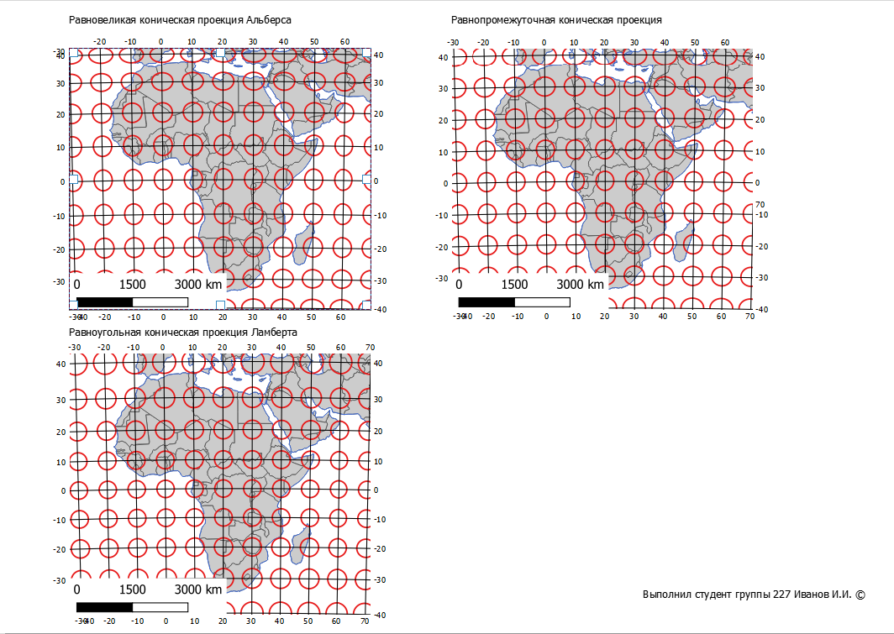

# Математическая основа карт {#map-math}

## Полезные ссылки {#map-math-links}

1. [Interactive Album of Map Projections 2.0](https://projections.mgis.psu.edu){target="_blank"}

2. [Map Projection Transitions](https://jasondavies.com/maps/transition){target="_blank"}

3. [Myriahedral projections](https://philogb.github.io/page/myriahedral){target="_blank"}

4. [Projection Wizard](https://projectionwizard.org){target="_blank"}

5. [G.Projector — Map Projection Explorer](https://www.giss.nasa.gov/tools/gprojector/download/){target="_blank"}


## Исходные данные {#map-math-initial-data}

[База данных в формате Geopackage](https://yadi.sk/d/U-bdDs1Q3gggdA){target="_blank"}

[Бланк задания](https://yadi.sk/i/8kNsQRI6E2DX1A){target="_blank"}

## Интерфейс QGIS {#map-math-interface}
[В начало справки ⇡](#map-math)

При вызове QGIS Desktop и создании нового проекта окно программы будет состоять из основных панелей и окон: 1) самое большое окно в середине – окно карты, где происходит визуализация пространственных данных; 2) слева панель со слоями – перечнем основных используемых слоёв данных; 3) панель Браузера – встроенного проводника по файловой системе компьютера. Панелей и окон может быть больше. Их полный перечень становится доступен при щелчке правой кнопкой мыши по пустому месту сверху на панели. Включенная галочка в списке означает, что панель или окно активны.


Как правило, по умолчанию открыта панель работы со слоями (на рисунке слева). Именно с помощью этой панели возможно добавление данных в проект. Обратите внимание, что для добавления векторных, растровых, табличных и прочих данных предусмотрены разные иконки. Добавлять данные в проект также можно двойным щелчком по объекту в браузере.

С помощью колёсика мыши можно изменять масштаб изображения, а с помощью зажатого колёсика можно передвигаться по карте. Внизу окна карты есть окошко с текущим масштабом изображения, рядом с ним окошко с координатами курсора. По умолчанию координаты даются в системе координат проекта карты, но единиц измерения можно поменять в свойствах проекта.

**Проект QGIS** – это файл, в котором хранятся ссылки на пространственные данные (**но не сами пространственные данные!**), а также настройки их символики, подписей, система координат карты, история геообработки и некоторые другие вещи. Файл проекта имеет формат **QGZ** и позволяет открыть проект в том виде (с теми слоями и их свойствами), в котором его последний раз сохраняли. Сохраните проект после добавления необходимых слоёв или изменения настроек их отображения **Проект – Сохранить**, либо нажмите на соответствующую иконку.

Открыть свойства самого проекта можно выбрав **Проект – Свойства...**


В свойствах проекта можно менять, например, систему координат. **Обратите внимание, от изменения системы координат проекта система координат слоёв в этом проекте не поменяется**. Программное обеспечение умеет на лету перепроецировать слои в разных системах координат, поэтому мы их в проекте можем видеть вместе (если, конечно, данные в них на одну территорию).

Для навигации по окну карты используйте панель инструментов перемещения по карте . Среди них есть инструменты изменения масштаба, перемещения, показа карты в экстенте (полный охват).


## Системы координат {#map-math-crs}
[В начало справки ⇡](#map-math)

В программном обеспечении ГИС традиционно принято выделять две большие категории систем координат (СК): 1) географические СК, 2) спроецированные СК

> **Географические системы координат** основаны на датумах. _Датум_ – это параметры размещения эллипсоида внутри тела земли. Для одного эллипсоида может быть много датумов. Единицы измерения в ГСК – широта и долгота в градусах.

> **Спроецированные системы координат** основаны на проекциях. Проекция – это математически обусловленное правило перехода от поверхности эллипсоида к плоскости карты. Единицы измерения в спроецированных СК – метры, километры, мили, футы и прочие единицы длины.

Проекций великое множество, они подразделяются по характеру искажений и по применяемым для построения вспомогательным геометрическим фигурам. Подробнее об этом можно узнать из учебников [[Картография, 2002](https://yadi.sk/i/Fg77Q031F0lMoQ){target="_blank"}; [Серапинас, 2005](https://yadi.sk/i/ezOs-xC47oPmFg){target="_blank"}]

В ГИС ПО системы координат могут быть представлены тремя основными форматами:

1. EPSG или ESRI  код

    > EPSG коды – коды проекций, которые присваиваются Международной ассоциацией производителей нефти и газа. Все коды с возможностью подбора проекции для территории собраны в [реестре](http://www.epsg-registry.org/). Более удобный инструмент для поиска собран в [ресурсе](http://epsg.io). Например, у наиболее часто встречающейся ГСК WGS 1984 – EPSG:4326, у проекции WGS 1984 UTM 37N – EPSG:32637. Обратите внимание, что далеко не все существующие проекции и системы координат имеют код EPSG.
    
    > ESRI коды – коды проекций, которые присвиваются Институтом исследования систем окружающей среды (Environmental Systems Research Institute) – производителя программного обеспечения семейства ArcGIS.

2. WKT

    > WKT – Well-Known text – один из форматов записи параметров системы координат в текстовом человекочитаемом виде. Ознакомиться со стандартом можно по [ссылке](http://docs.opengeospatial.org/is/18-010r7/18-010r7.html), раздел 7.5.

Например, запись для цилиндрической проекции Миллера на эллипсоиде WGS 1984 будет выглядеть следующим образом:
    
```{wkt}
    World_Miller_Cylindrical
WKT
PROJCRS["World_Miller_Cylindrical",
    BASEGEOGCRS["WGS 84",
        DATUM["World Geodetic System 1984",
            ELLIPSOID["WGS 84",6378137,298.257223563,
                LENGTHUNIT["metre",1]]],
        PRIMEM["Greenwich",0,
            ANGLEUNIT["Degree",0.0174532925199433]]],
    CONVERSION["World_Miller_Cylindrical",
        METHOD["Miller Cylindrical"],
        PARAMETER["Longitude of natural origin",0,
            ANGLEUNIT["Degree",0.0174532925199433],
            ID["EPSG",8802]],
        PARAMETER["False easting",0,
            LENGTHUNIT["metre",1],
            ID["EPSG",8806]],
        PARAMETER["False northing",0,
            LENGTHUNIT["metre",1],
            ID["EPSG",8807]]],
    CS[Cartesian,2],
        AXIS["(E)",east,
            ORDER[1],
            LENGTHUNIT["metre",1]],
        AXIS["(N)",north,
            ORDER[2],
            LENGTHUNIT["metre",1]],
    USAGE[
        SCOPE["unknown"],
        AREA["World"],
        BBOX[-90,-180,90,180]],
    ID["ESRI",54003]]
```

В разделе **BASEOGCRS** вы можете увидеть датум, эллипсоид с параметрами, единицу длины, начальный меридиан и угловые единицы.

В разделе **CONVERSION** указываются параметры **False easting** и **False northing**, которые обозначают сдвиг начала координат по соответствующим осям.

В разделе **CS** указывается, что используется декартова система координат (**Cartesian**) с двумя осями, далее для осей указаны их направления, порядок перечисления и единицы измерения.

В разделе **USAGE** указывается, на какую территорию применима данная проекция.

В разделе **ID** указан идентификатор этой проекции в ESRI.

Кроме этого, для многих проекций в параметрах могут указываться широта (**Latitude of natural origin**) и долгота (**Longitude of natural origin**) начала координат, если они отличаются от экватора и гринвича. Параметры сдвига начала счёта прямоугольных координат задаются относительно этой точки.

Для нормальных конических секущих проекций указываются две стандартные параллели (**Latitude of 1(2)st standard parallel**).

3. PROJ (PROJ4)

    > PROJ – формат записи системы координат, разработанный для библиотеки Proj, предназначенной для преобразования проекций.

Запись для уже знакомой нам проекции Миллера будет выглядеть следующим образом:


```{proj}
+proj=mill +R_A +lon_0=0 +x_0=0 +y_0=0 +datum=WGS84 +units=m +no_defs
```

Из строки видно, что в ней содержится информация о начальном меридиане, сдвиге начала прямоугольной системы координат, датуме, а также единицах измерения.

Ресурс [Projectionwizard](https://projectionwizard.org){target="_blank"}  позволяет подобрать проекцию под конкретную территорию. Возле названия рекомендуемой проекции вы можете увидеть ссылки на proj и wkt строки, которые можно скопировать.


Чтобы добавить пользовательские системы координат в QGIS, необходимо вызвать пункт главного меню **Установки – Пользовательские проекции...**


В открывшемся окне нажмите на плюсик для добавления новой СК. Заполните название проекции, укажите тип представления информации и вставьте строку с параметрами в окно. **Название проекции следует давать латинскими буквами без пробелов**.


## Искажения картографических проекций {#map-math-distortions}
[В начало справки ⇡](#map-math)

Искажения могут быть наглядно представлены в виде индикатрис Тиссо. Индикатриса представляет собой эллипс, в котором большой _**a**_ и малый _**b**_ диаметры показывают направления наибольшего искажения частных масштабов длин. На земном эллипсоиде эти эллипсы все выглядят одинаково и представляют собой окружности, но при переводе в спроецированную систему координат искажаются в разной степени в зависимости от особенностей проекции и положении на карте. Радиусы в эллипсе вдоль меридиана _**m**_ и параллели _**n**_ характеризуют искажения частных масштабов длин вдоль меридианов и параллелей. По форме эллипсов можно понять, какого рода искажения характерны для данной проекции в конкретном месте карты: углов, площадей, форм.


Частный масштаб площадей _**p**_ может быть рассчитан следующим образом:

$$p= mn\sin(\theta)$$

Здесь $\theta$ – угол между параллелью и меридианом в центре эллипса.

$$a + b= \sqrt{m^2 + n^2 + 2p}$$

$$a - b= \sqrt{m^2 + n^2 - 2p}$$

Искажения углов $\omega$ можно найти по формуле

$$\sin(\frac{\omega}{2}) = \frac{(a-b)}{(a+b)}$$

## Построение эллипсов искажения в QGIS {#map-math-tissot}
[В начало справки ⇡](#map-math)

Для построения эллипсов искажений в QGIS необходимо установить дополнительный плагин. Его можно скачать по [ссылке](http://plugins.qgis.org/plugins/tiss/){target="_blank"}.

В окне программы в главном меню наверху выберите пункт **Модули – Управление и установка модулей...**.


Выберите пункт **Install from ZIP** и укажите путь к скаченному архиву. Нажмите на **Install Plugin**.

После установки модуль появится в выпадающем списке панелей инструментов под названием **tiss**. Сама панель состоит из одной кнопки . После нажатия на неё откроется окошко для построения эллипсов.


В разделе **Extent**  мы указываем охват, в пределах которого строятся эллипсы. В разделе **Resolution** указывается шаг частоты индикатрис по широте и долготе в градусах. В разделе **Radius of the caps** указывается радиус эллипса либо в градусах, либо в километрах. Параметры **a** и **b** – это полуоси эллипсоида. **Cap segments** и **Line segments** – количество сегментов у эллипса и линий сетки. Кнопка **Run** запускает построение эллипсов искажений и сетки меридианов и параллелей.

Если у вас возникли проблемы с построением эллипсов и сетки – их положение не совпадает с границами объектов из базы данных, обратитесь к [технической справке ⇣](#map-math-issues)

Для оценки параметров искажений в конкретных узлах градусной сетки на примере эллипсов искажений можно использовать соответствующие инструменты. Измерения в QGIS осуществляются с помощью инструмента линейки . Он находится на панели атрибутов . Там же можно выбрать инструмент для измерения углов . При измерении длин появляется окно, где показаны настройки измерений.


Для измерения в проекции необходимо выбрать пункт **Прямоугольный**. Построение ломаной линии осуществляется нажатием левой кнопки мыши. Закончить сегмент можно правой кнопкой мыши.

Для удобства измерений можно включить инструмент прилипания, расположенные на одноименной панели. Прилипание (snapping) – это притягивание узлов рисуемой пользователем линии к уже существующим объектам. Для включения прилипания нажмите на кнопку магнита . На этой же панели можно настроить прилипание, например, к местам пересечения объектов .

## Работа с компоновкой в QGIS {#map-math-layout}
[В начало справки ⇡](#map-math)

Итоговое оформление карты в ГИС-пакете QGIS осуществляется в режиме макета. Для этого надо найти пункт меню **Проект – Создать макет**. После ввода имени макета откроется отдельное окно, в котором нам предстоит скомпоновать наше картографическое изображение.


На пустом листе с помощью специальных кнопок слева можно разместить одно или несколько картографических изображений , текстовые элементы , масштабную линейку , легенду . Для перемещения изображения карты внутри рамки используйте кнопку 

После добавления элементов карты их перечень появляется в окошке справа вверху. Если выделить элемент, ниже открываются его свойства. Для карты можно указать главный масштаб и систему координат.


 
В разделе Сетки нажмите на плюсик, чтобы добавить сетку. Выделив сетку и нажав на кнопку **Modify Grid**, мы можем редактировать её отображение.


> Обратите внимание, что содержание картографического изображения в компоновке полностью синхронизируется с содержанием проекта. Если вы хотите установить линии сетки с подписями, то необходимо отключить слой с сеткой в основном окне программы во избежание избыточного дублирования.

По умолчанию для картографического изображения строится сетка в заданной СК. Если вы хотите построить градусную сетку, то для неё необходимо указать соответствующую геодезическую систему координат в настройках внешнего вида.


В разделе **Draw Coordinates** можно настроить ориентировку подписей выходов сетки, точность и другие параметры. Для выхода из свойств сетки нажмите на стрелку назад 
 
В свойствах карты включите опцию Рамка. Настройте её ширину.

Итоговый вариант компоновки может выглядеть следующим образом:





Для экспорта растрового изображения выберите **Макет – Экспорт в …**


## Варианты решения некоторых технических проблем {#map-math-issues}
[В начало справки ⇡](#map-math)

### Некорректное построение эллипсов искажений и координатной сетки {#map-math-issues-ellipses}

Если положение объектов карты и эллипсов искажений не совпадает, вероятно, что у вас возник конфликт системного разделителя. Используемый модуль работает с десятичным разделителем в виде точки. Если у вас в системе настроен десятичный разделитель в виде запятой, его необходимо поменять на точку.

В ОС **Windows 10** это делается следующим образом:

1. Вызовите пункт **Параметры** в меню **Пуск**.


2. Выберите пункт **Время и язык**.


3. Выберите пункт **Формат даты, времени, региона**.


4. Выберите пункт **Дополнительные параметры даты и времени, региональные параметры**.


5. Выберите пункт **Изменение форматов даты, времени и чисел**.


6. В открывшемся окне вызовите **Дополнительные параметры...**.


7. Укажите в качестве разделителя целой и дробной части точку.


### Некорректное отображение геометрии {#map-math-issues-selfintersecting}

Иногда при изменении проекции карты возникают проблемы с отображением векторных объектов, как на рисунке ниже.


Это обусловлено ошибками геометрии при переходе через долготу 180°. К сожалению, на данный момент в QGIS нет решения данной проблемы. Картинка может стать менее загромождённой лишь при изменении масштаба (увеличении). Если это не помогает, остаётся только убрать заливку у полигональных объектов, что немного облегчит восприятие.

----
_Карпачевский А.М._ **Картография: практикум в QGIS**. М.: Географический факультет МГУ, `r lubridate::year(Sys.Date())`.
----