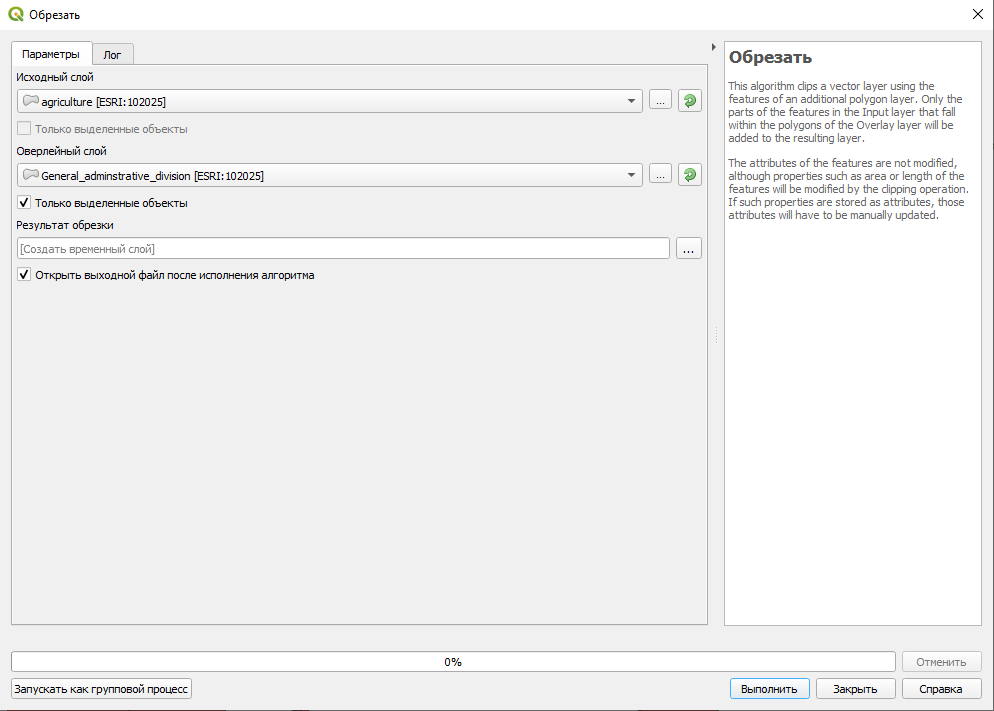
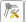
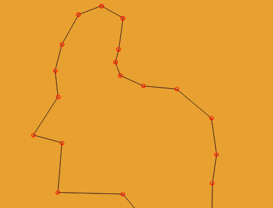
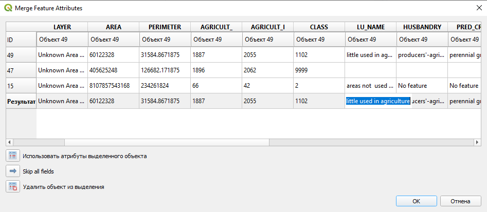
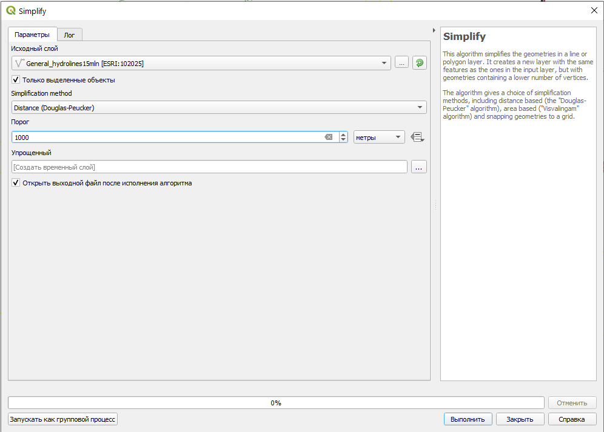
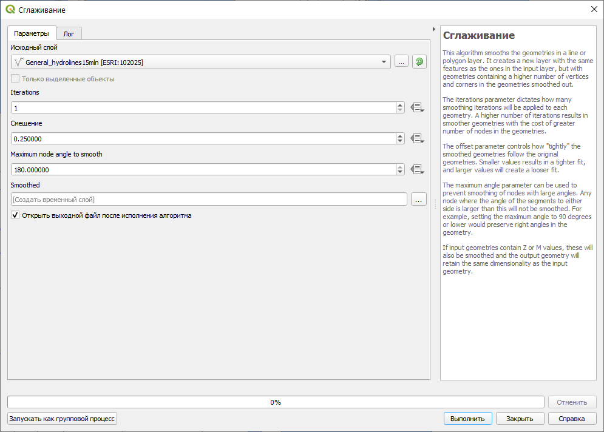
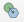
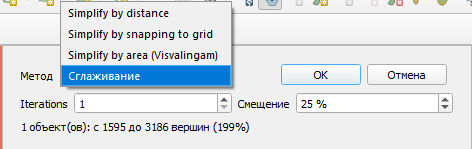
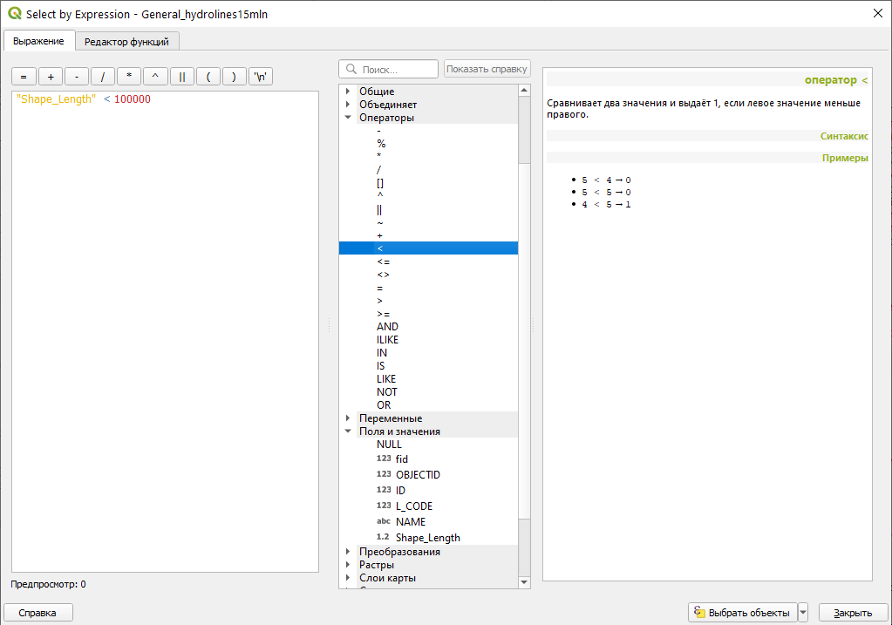

# Картографическая генерализация {#map-generalize}

## Исходные данные {#map-generalize-initial-data}

[Бланк задания](https://yadi.sk/i/skQX5kEeM74goQ){target="_blank"}

[База данных земельных ресурсов России в формате Geopackage (полная)](https://yadi.sk/d/K2oSf5-GVi2ovg){target="_blank"}

[Базы данных по тематикам](https://yadi.sk/d/V7tUX7dYGBjkOQ){target="_blank"}

[Данные по земельным ресурсам России на официальном сайте](https://webarchive.iiasa.ac.at/Research/FOR/russia_cd/download.htm#download){target="_blank"}

## Приёмы генерализации {#map-generalize-methods}
[В начало справки ⇡](#map-generalize)

Все приёмы генерализации по К.А. Салищеву [[Салищев, 1982](https://yadi.sk/i/e9gW1TmzdEUQqg){target="_blank"}] применительно к геоинформационному ПО можно разделить с точки зрения работы пользователя. Часть приёмов подразумевает, что пользователь при генерализации редактирует геометрию (правит векторную составляющу, работает с узлами), другая часть подразумевает работу с атрибутами объектов, либо вообще – создание нового абсолютно нового класса объектов, зачастую – другого типа геометрии.

Приём генерализации                     |Работа с геометрией|Работа с атрибутами|Изменение типа геометрии
----------------------------------------|-------------------|-------------------|------------------------
`Упрощение`                             |**+**              |**-**              |**-**
`Объединение`                           |**+**              |**-**              |**-**
`Сдвиг`                                 |**+**              |**-**              |**-**
`Утрирование`                           |**+**              |**-**              |**-**
`Отбор`                                 |**-**              |**+**              |**-**
`Обобщение качественных характеристик`  |**-**              |**+**              |**-**
`Обобщение количественных характеристик`|**-**              |**+**              |**-**
`Переход от простых понятий к сложным`  |**-**              |**-**              |**+**

## Подготовка данных {#map-generalize-preprocessing}
[В начало справки ⇡](#map-generalize)

Работая с готовым набором данных зачастую возникает необходимость в обрезке территории по некому заданному контуру. В ГИС-пакете QGIS для этого можно воспользоваться специальным инструментом. Например, для обрезки векторного слоя по границе региона выделите с помощью инструмента  нужные объекты, после чего они подсветятся жёлтым цветом. В главном меню программы найдите **Вектор – Геообработка – Обрезать...**. Откроется окно, в котором указывается исходный слой и слой, по которому мы хотим обрезать исходный слой. При необходимости ставим галочку, если работа идёт с выделенными объектами. По умолчанию новый слой сохранится как временный, но можно и указать путь для сохранения.

Для сохранения нового слоя в нужную нам базу данных нужно указать путь к этой базе. После этого во всплывающем окне укажите имя выходного слоя.

## Ручные приёмы работы с геометрией {#map-generalize-geometry-manual}
[В начало справки ⇡](#map-generalize)

При упрощении, сдвиге и утрировании объектов на карте приходится редактировать геометрию существующих объектов. Для перехода в режим узлов включите редактирование, а затем нажмите на кнопку . После этого вы сможете левой кнопкой мыши двигать вершины объектов, двигать рёбра и добавлять новые вершины нажатием на плюс. Для удаления вершины нажмите **Delete**.

Во время работы с уже готовыми слоями векторных данных зачастую приходится редактировать границы двух смежных объектов. Это удобно делать одновременно для двух объектов сразу, а не по отдельности. Такой вид редактирования называется топологическим, и вы его можете найти на панели инструментов прилипания . После этого одним нажатием левой кнопки мыши вы можете выбрать ребро или вершину, перетащить их и вторым нажатием зафиксировать новое положение, либо удалить лишние вершины.

Для объединения нескольких векторных объектов в один нужно выбрать объекты и нажать на кнопку , которая расположена на панели дополнительных инструментов оцифровки. Перед вами откроется окно, в котором будут показаны атрибуты склеиваемых объектов и атрибут нового объекта в строке **Результат**. Если результирующий атрибут вас не устраивает, вы можете вписать нужное значение в соответствующее поле, либо выделить строку с нужным набором атрибутов и нажать на кнопку **Использовать атрибуты выделенного объекта**.

## Автоматизированные приёмы работы с геометрией {#map-generalize-geometry-automate}
[В начало справки ⇡](#map-generalize)

В QGIS доступны некоторые инструменты автоматизированного упрощения геометрии. Выберите в главном меню **Вектор – Обработка геометрии – Simplify...**. Откроется инструмент, упрощающий геометрию объектов. Для линейных объектов рекомендуется выбирать алгоритм Дугласа-Пейкера.

Данный алгоритм убирает вершины согласно заданному порогу, который устанавливается пользователем на основе масштаба и детализации исходных данных.

К полигональным слоям этот инструмент тоже применим, но его работа не всегда корректна – на стыке трёх или более объектов возникают топологические ошибки (дырки и наложения), поэтому его применять следует осторожно не для сплошного покрытия полигональных объектов.

В QGIS есть инструмент для сглаживания векторных объектов. Для его использования нужно открыть окно **Инструментов анализа** и в нём найти инструмент **Векторная геометрия – Сглаживание**.

> Обратите внимание, что оба инструмента не изменяют текущий слой, а создают новый.

Упрощение и сглаживание объектов доступно в индивидуальном порядке в текущем слое на панели инструментов дополнительной оцифровки. Выбрав редактируемый слой в режиме редактирования, нажмите на кнопку , после чего кликните по объекту, который вы хотите упростить. Откроется маленькое окошко, в котором можно выбрать метод сглаживания, либо упрощения.

## Ценз отбора через SQL-запрос {#map-generalize-geometry-sql}
[В начало справки ⇡](#map-generalize)

**SQL** – Structered query language (структурированный язык запросов) – очень надёжный и удобный способ делать выборки объектов в базе данных ГИС по значениям их атрибутов. Подробнее об SQL-запросах вы узнаете из курса _Основы геоинформатики_, а сейчас мы ограничимся простым примером, как можно выбрать, например, все реки, длина которых менее, чем заданный ценз отбора.

Для выборки объектов нужно открыть атрибутивную таблицу соответствующего слоя. Наверху таблицы найдите кнопку . Откроется окно, состоящие из трёх вложенных окон. В левом окне пишется собственно запрос, в центральном окне можно выбрать названия атрибутов, значения атрибутов, функции и прочее, в правом окне даётся текстовая справка.

В разделе ***Поля и значения** выберите название поля, по которому осуществляется запрос, дважды щёлкните, чтобы оно появилось в левом окошке. В разделе **Операторы** выберите соответствующий оператор. Справа от оператора укажите соответствующее значение ценза в единицах измерения слоя.

----
_Карпачевский А.М._ **Картография: практикум в QGIS**. М.: Географический факультет МГУ, `r lubridate::year(Sys.Date())`.
----