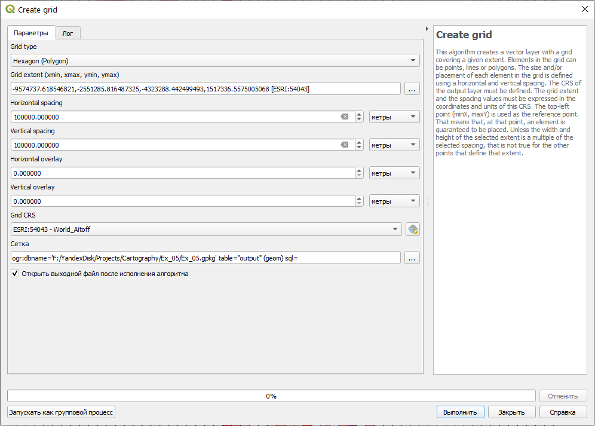
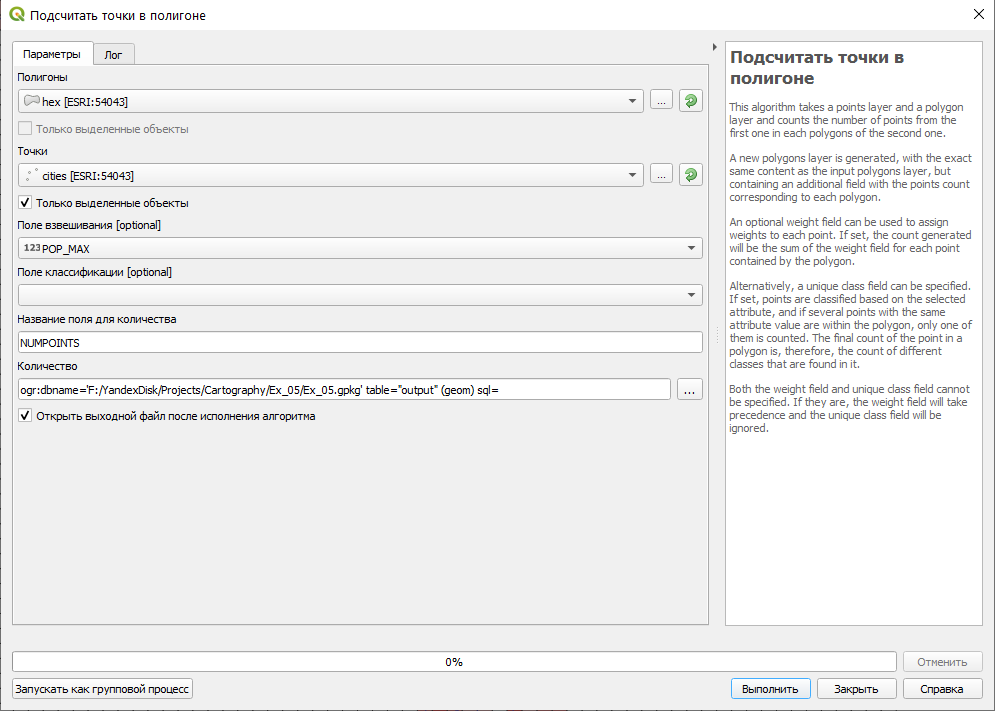
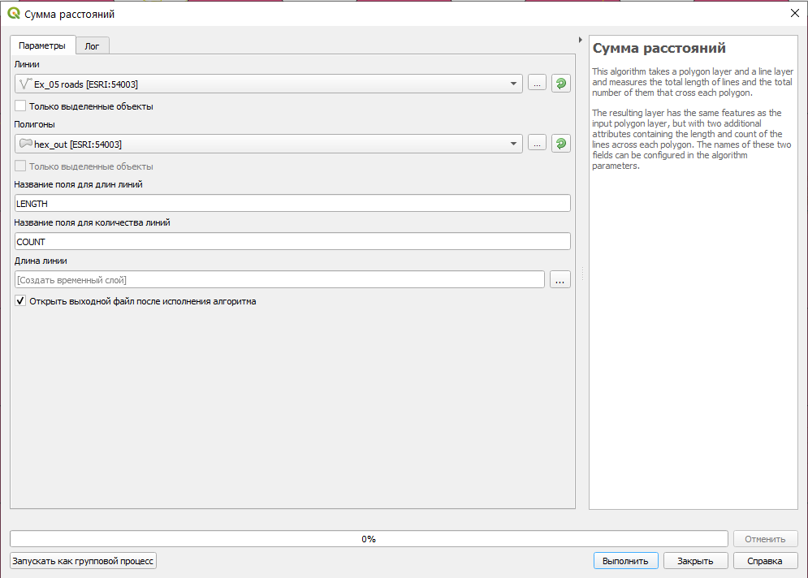
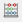
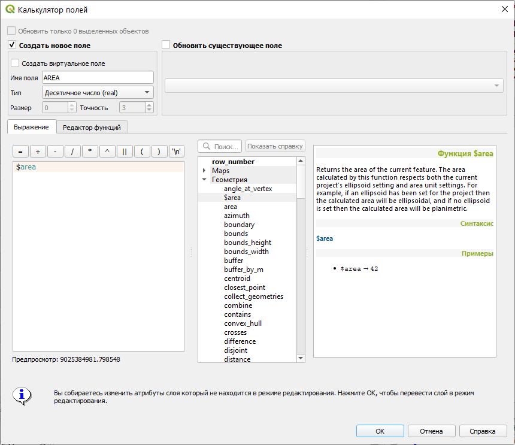

# Картографический метод исследования {#map-use}

## Исходные данные {#map-use-initial-data}

[Бланк задания](https://yadi.sk/i/3F-Zp7v-FCc0yA){target="_blank"}

## Полезные ссылки с пространственными данными {#map-use-links}

[Данные Natural Earth](https://www.naturalearthdata.com/downloads/){target="_blank"}

[Данные OpenStreetMap](http://download.geofabrik.de/){target="_blank"}

[Цифровая общегеографическая основа ВСЕГЕИ](http://www.vsegei.com/ru/info/topo/){target="_blank"}

[Многоуровневое административное деление на мир и на отдельные страны](https://gadm.org/data.html){target="_blank"}

## Приёмы использования карт {#map-use-methods}
[В начало справки ⇡](#map-use)

Приёмы                             |
-----------------------------------|-----------------------
`Описания по картам`               |``
`Графические приёмы`               |``
`Графоаналитические приёмы`        |``
`Методы математического анализа`   |``
`Методы математической статистики` |``
`Методы сетевого анализа`          |``

## Построение регулярных сеток {#map-use-grid}
[В начало справки ⇡](#map-use)

Для построения регулярных сеток используйте инструмент **Вектор – Выборка – Create Grid...**. В строке параметра **Grid type** можно выбрать тип регулярной сетки: точки, линии, прямоугольник, ромб и гексагон. В строках **Horizontal spacing** и **Vertical spacing** указываются размеры ячеек. В строках **Horizontal overlay** и **Vertical overlay** задаётся перекрытие между ячейками. Лучше всего в качестве системы координат указывать проекцию, а результат сохранять либо в шейпфайл, либо в существующую базу данных Geopackage.

## Расчёт значений на сетку территориального деления {#map-use-calculation}
[В начало справки ⇡](#map-use)

Мы можем рассчитывать количество точек для каждой ячейки в пределах сетки территориального деления. Для этого используется инструмент **Вектор – Анализ – Подсчитать точки в полигоне...**. В этом инструменте указывается слой с соответствующими полигонами и слой с точками, плотность которых мы хотим получить.

> Обратите внимание, что под входными слоями можно выставить опцию для учёта только выбранных объектов. Это оправдано в случае, если вы работаете только с частью данных, а обработка занимает продолжительное время.

В качестве поля взвешевания можно указывать численное атрибутивное поле, например, численность населения.

Для линейных объектов можно использовать инструмент **Вектор – Анализ – Сумма расстояний...**. Он работает аналогично предыдущему инструменту.

Для приведения рассчитанных значений ячеек в относительный вид необходимо воспользоваться калькулятором поля. Для ячеек можно рассчитать площадь, зайдя в таблицу атрибутов и нажав на кнопку . Для создания нового поля установите соответствующую галочку сверху, а для обновления поля укажите его сверху справа. Для нового поля необходимо указать имя и тип данных. Для расчёта площади можно воспользоваться стандартной функцией **$area**.

> Обратие внимание, что функция **$area** считает площадь на эллипсоиде, а не в проекции.

Для расчёта относительных значений вы можете написать соответствующее выражение из отдельных атрибутивных полей, выбрав их названия в разделе **Поля и значения**.

## Построение геополей {#map-use-surface}
[В начало справки ⇡](#map-use)

При построении геополей с помощью геоинформационных инструментов мы переходим к растровой модели данных.

> Растр – регулярно-ячеистая модель данных, где каждой ячейке (пикселю) соответствует какое-либо значение.

Один из инструментов континуализации – построение поверхности ядерной плотности (kernel density), которая также известна за рубежом как тепловая карта (heatmap).

----
_Карпачевский А.М._ **Картография: практикум в QGIS**. М.: Географический факультет МГУ, `r lubridate::year(Sys.Date())`.
----