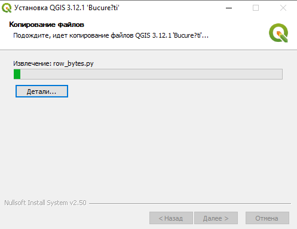
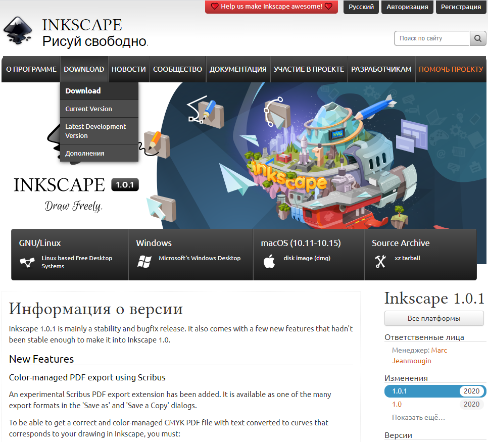

--- 
title: "Картография: практикум в QGIS"
author: "Карпачевский А.М."
date: "`r Sys.Date()`"
site: bookdown::bookdown_site
documentclass: book
bibliography: [book.bib, packages.bib]
biblio-style: apalike
link-citations: yes
description: "Картография: практикум в QGIS"
colorlinks: true
github-repo: iowq750/cartography
fontsize: 12pt
mainfont: PT Serif
toc_float:
  collapse: section
  smooth_scroll: true
apple-touch-icon: images/apple-touch-icon.png
apple-touch-icon-size: 120
favicon: images/favicon.ico
---

# Программное обеспечение для работы {-}

## QGIS {-}

Для выполнения работ в курсе «картография» вам потребуется скачать и установить на свой компьютер геоинформационное приложение QGIS. Это свободно распространяемое программное обеспечение, то есть для его установки не требуется покупка или регистрация. 

### Windows {-}

Скачайте с официального сайта последнюю стабильную версию QGIS (3.10). Выберите версию в зависимости от разрядности вашей системы: [64 bit](https://qgis.org/downloads/QGIS-OSGeo4W-3.10.3-3-Setup-x86_64.exe){target="_blank"}, [32 bit](https://qgis.org/downloads/QGIS-OSGeo4W-3.10.3-3-Setup-x86.exe){target="_blank"}.

Когда исполняемый файл загрузится, запустите его. Если потребуется, разрешите приложению вносить изменения на вашем устройстве. 

Будет показано приветственное окно мастера установки.

Нажмите «Далее», чтобы перейти на следующий шаг

На следующем шаге будет показано лицензионное соглашение QGIS и другого программного обеспечения, входящего в пакет поставки.

Нажмите «Принимаю».

На следующем шаге выберите папку для установки. По возможности используйте расположение, предлагаемое по умолчанию.

На следующем шаге предлагается выбрать дополнительные компоненты для установки. Снимите все флажки, кроме QGIS, и нажмите «Установить»

После окончания установки ярлыки QGIS будут добавлены в меню "Пуск" и в отдельную папку QGIS на рабочем столе.

### macOS {-}

По состоянию на `r Sys.Date()` для прохождения практикума рекомендуется использовать альтернативную сборку версии [3.4.12](https://www.kyngchaos.com/files/software/qgis/QGIS-macOS-3.4.12-1.dmg){target="_blank"}. Перейдя по ссылке, необходимо согласиться сохранить образ установочного диска  на компьютер (можно разрешить его сразу открыть средствами _DiskImageMounter_):

После того как образ загрузится и будет открыт, необходимо последовательно запустить три установщика, выделенные на снимке экрана ниже (именно в том порядке, в котором они пронумерованы!):

Установщики __GDAL Complete__ и __QGIS 3 LTR__ необходимо запускать через контекстное меню и выбирать пункт "Открыть":

В появившемся диалоговом окне необходимо нажать "Открыть", чтобы разрешить установку:

Все опции при установке каждой компоненты приложения оставляйте по умолчанию, ничего не меняйте и нажимайте в диалоговых окнах "Продолжить", пока не запустится установщик.

После того как последняя компонента — __QGIS__ — будет установлена, вы сможете найти приложение и запустить его из каталога _Программы_ macOS:

### Linux {-}

Воспользуйтесь инструкциями по [этой ссылке](https://qgis.org/ru/site/forusers/alldownloads.html#linux){target="_blank"}.

Дополнительную информацию по установке можно найти на [https://qgis.org/ru/site/forusers/download.html](https://qgis.org/ru/site/forusers/download.html){target="_blank"}.

## Inkscape {-}

Для некоторых операций оформления карты невозможно обойтись только геоинформационным ПО. Открытый графический пакет **Inkscape** доступен для скачивания на [официальном сайте](https://inkscape.org/ru/){target="_blank"}.

Выберите дистрибутив для вашей операционной системы.

Если вы устанавливаете Inkscape на Windows, выберите разрядность вашей системы

Для скачивания необходимо выбрать **Windows Installer Package** (формат файла MSI).

Установку лучше всего запускать от имени администратора.
